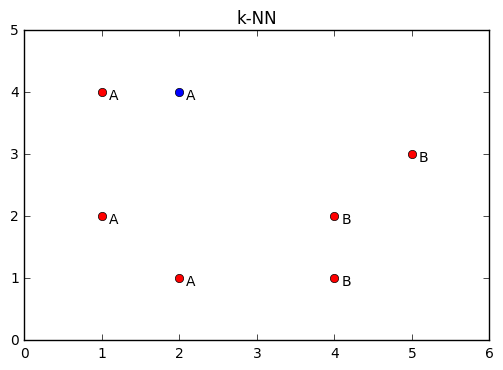

```python
import numpy as np
import operator
from collections import Counter
import matplotlib.pyplot as plt

#k-nn의 의미 : 확인하고 싶은 데이터와 가장 가까운 거리에 위치하는 k개의 데이터의 label 을 따라갑니다. 
#데이터 셋 구성 
x_data = np.array([ [1.0, 2.0],[2.0,1.0], [1.0,4.0], [4.0, 1.0], [4.0, 2.0],[5.0,3.0] ])
y_data = np.array(['A', 'A','A', 'B', 'B','B'])

#인접한 데이터를 몇개를 사용할 지를 정합니다. k 의 개수가 작으면 오버피팅이 발생할 수 있습니다. 또한 k의 개수는 홀수를 사용합니다.
k=3

#테스트 할 데이터 : 최종적으로 이 데이터가 'A' 와 'B' 중에 어디에 속할지를 알려줍니다.
#다른 값으로 측정하시고 싶으시다면 [3,4] 부분을 수정해 주세요.
test_x = [2,4]

    
#데이터와의 거리를 측정하기 위한 함수를 생성합니다.
#거리를 측정하기 위해 피타코라스 정리를 사용합니다. 
def calculate_distance(test_x, x_data, y_data):
    
    #tile 은 반복행렬 만들 때 사용합니다. x_data의 모든 row와 차를 구하기 위해 사용합니다.
    # dataSetSize = 4
    datasize = x_data.shape[0] 
    # 1은 row에서 반복횟수를 나타냅니다.
    sub_vectors = np.tile(test_x, (datasize, 1)) - x_data 
    
    square_vectors = sub_vectors ** 2
    
    sum_vectors = np.array([sum(x) for x in square_vectors])
    
    distances = sum_vectors**0.5
    
    # argsort 는 솔트된 값들을 index의 값으로 반환합니다.
    # ex) 거리를 계산한 결과가 [2,3,5,1] 이면 argsort()를 사용했을 때, [3,0,1,2] 로 출력됩니다.
    sortIndex = distances.argsort()
    
    return sortIndex

#테스트 데이터와 인접한 k개의 데이터 중에 더 많은 label을 가지는 쪽으로 결과를 반환해 예측결과를 확인합니다.
def k_NN_model(test_x, x_data, y_data, k, sortIndex):
    
    find_label = []
    # argsort로 sort된 값들을 라벨로 맞춰주기 위해 사용합니다.
    for i in range(k):
        fit_label = y_data[sortIndex[i]]
        find_label.append(fit_label)
        
    #counter는 리스트의 값들이 중복횟수를 찾을 때 사용할 수 있습니다. 즉 테스트 데이터는 중복이 많이 된쪽으로 예측합니다.
    count = Counter(find_label)
    
    #counter 의 형태는 Counter({'romantic:2,'action':1}) 형태. 가장많이 중복된 label 값만 따오기 위해서 [0][0] 사용합니다.
    #most_common 함수는 가장 큰 값을 가지는 결과를 반환합니다. 1을 사용한 이유는 1개의 큰값만을 받기위함입니다. 2를 사용하면 
    #가장 큰값, 그 다음의 큰값 2가지의 결과를 반환합니다.
    result = count.most_common(1)[0][0]
    
    return result


sortIndex = calculate_distance(test_x, x_data, y_data)
result = k_NN_model(test_x, x_data, y_data,k,sortIndex) 
print('이 데이터는',result,'로 분류 될 수 있습니다.')

#산점도를 통해 데이터의 분포형태를 파악합니다. 시각적으로 표현하기 위함입니다. 꼭 필요한 부분은 아닙니다.
x_value = []
y_value = []
for i in range(len(x_data)):
    x_value.append(x_data[i][0])
    y_value.append(x_data[i][1])
plt.plot(x_value,y_value,'ro')
plt.plot(test_x[0],test_x[1],'bo')
for label, x, y in zip(y_data, x_value, y_value):
    plt.annotate(label,
                 xy=(x, y),
                 xytext=(5, -5),
                 textcoords="offset points")

plt.annotate(result,xy=(test_x[0],test_x[1]),xytext=(5,-5),textcoords='offset points')    
plt.axis([0,6,0,5])
plt.title("k-NN")
plt.show()

```

    이 데이터는 A 로 분류 될 수 있습니다.
    





```python

```
